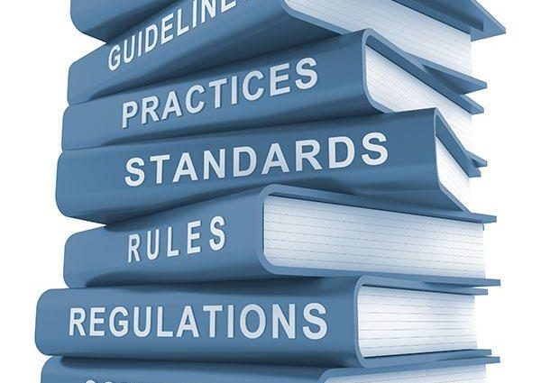

# I/O Psychology Doctoral Program Roles and Policies

This handbook details the key procedures and policies for the I/O doctoral and MA program experience. The original goal was to have a final draft of this handbook completed by December 1st 2020, which is the soft deadline for our second official doctoral application cycle. 

This manual details formal procedures for the following areas:  

1. Doctoral Student Selection; Chapter \@ref(select),  
2. I/O Program (MA and PhD) Probation Standards; Chapter \@ref(develop),  
3. Prospective Comprehensive Exams; Chapter \@ref(comps),  
4. [Student Mentorship](https://bookdown.org/kulasj/mentorship/) and Program Culture; Chapter \@ref(culture), and  
5. Dissertation Process; Chapter \@ref(dissertation) 

As benchmarks, here are some program manuals from other programs:

+ [Clemson](https://www.clemson.edu/cbshs/departments/psychology/files/pdf/handbook-psychology-graduate-current.pdf)
+ [UCF](https://graduate.ucf.edu/wp-content/uploads/2019/05/Industrial-and-Organizational-Psychology-PhD.pdf)
+ [Tulsa](https://artsandsciences.utulsa.edu/wp-content/uploads/sites/6/2015/09/2017-I-O-Handbook.pdf)

It would be great help if each of us could volunteer to develop one or more of these policies and then educate the other faculty on the process. We can submit each for review, feedback, and then finalize for our second official incoming class. We could each carve out the procedure **over the summer**, review as a group **at our first I/O meeting** in the Fall, then **update and finalize** by December 1st.